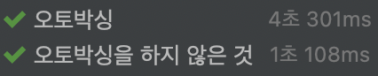

## 불필요한 객체 생성을 피하라


- ### 객채를 매번 생성하기보다는 재사용하는 편이 좋다
  - 똑같은 기능의 객체를 매번 생성하기보다는 객체 하나를 재사용하는것이 나을 때가 많다
  - `String s = new String("bikini");` -> 따라하지 말아야 할 것
    > 이 문장은 실행될 때 마다 String 인스턴스를 새로 만든다
  - `String s = "bikini"`
    > 새로운 인스턴스를 매번 만드는 대신 하나의 String 인스턴스를 사용한다 -> 재사용


- ### 정적 팩터리 메서드를 이용하여 불필요한 객체 생성을 방지하자
  - 미리 생성해 두자


- ### 객체 생성이 비싼 경우 캐싱을 통해 객체 생성을 방지해보자
  - 생성 비용이 아주 비싼 객체도 있다
  ``` java
  static boolean isRomanNumeral(String s) {
    return s.matches("^(?=.)M*(C[MD]|D?C{0,3})(X[CL]|L?X{0,3})(I[XV]|V?I{0,3})$");
  }
  ``` 
  > String.matches는 정규표현식으로 문자열 형태를 확인하는 가장 쉬운 방법이지만<br> 성능이 가장 중요한 상황에서 반복해 사용하기엔 적합하지 않다.
  - 성능을 개선하려면 필요한 정규표현식을 표현하는(불변인) `Pattern`인스턴스를 클래스 초기화 과정에서 <br>직접 생성해 캐싱해두고 나중에 `isRomanNumeral`메서드가 호출될 때 마다 이 인스턴스를 재사용한다

  ``` java
  public class RomanNumber {
    private static final Pattern ROMAN = Pattern.compile("^(?=.)M*(C[MD]|D?C{0,3})(X[CL]|L?X{0,3})(I[XV]|V?I{0,3})$");

    static boolean isRomanNumeral(String str) {
        return ROMAN.matcher(str).matches();
	}
  }
  ```
  > 개선된 `isRomanNumeral`방식의 클래스가 초기화된 후 이 메서드를 한 번도 호출하지 않는다면 <br>`ROMAN`필드는 쓸데없이 초기화된 꼴이지만 성능은 크게 개선되지 않아 지연초기화를 권하지는 않는다 


- ### 오토박싱을 주의하자
  - 오토박싱은 프로그래머가 기본타입과 박싱된 기본타입을 섞어 쓸 때 자동으로 상호 변환해주는 기술
  ```java
  @Test
    @DisplayName("오토박싱")
    void test1(){
        Long sum = 0L;
        for(long i = 0; i <= Integer.MAX_VALUE; i++) {
            sum += i;
        }
    }

    @Test
    @DisplayName("오토박싱을 하지 않은 것")
    void test2(){
        long sum = 0L;
        for(long i = 0; i <= Integer.MAX_VALUE; i++) {
            sum += i;
        }
    }
  ```
    

  - `sum`변수를 `long`이 아닌 `Long`으로 선언해서 불필요한 `Long`인스턴스가 2의 31승개가 만들어진 것이다
  - **박싱된 기본 타입보다는 기본타입을 사용하고, 의도치 않은 오토박싱이 숨어들지 않도록 주의하자**

--------------

- ## 핵심정리
  - **객체 생성은 비싸니 피해야 한다** 가 아니다 요즘은 `JVM`에서는 별다른 일을 <br>하지않는 작은 객체를 생성하고 회수하는 일이 크게 부담되지 않는다
  - 아주 무거운 객체가 아닌 다음에야 단순히 객체 생성을 피하고자 우리만의 객체 `pool`을 만들지 말자
  - 프로그램의 **명확성, 간결성, 기능**을 위해서 객체를 생성하는 것이라면 일반적으로 더 권장되는 일이다. <br>ex) VO
  - **아이템 50과 연관된 얘기**
    - 추가적으로 필요 없는 객체를 반복 생성했을 때의 피해보다 **방어적인 복사(아이템 50)**가 필요한 상황에서<br> 객체를 재사용했을 때의 피해가 훨씬 크다는 것을 항상 명심해야한다.
    - **객체 생성은 그저 코드 형태와 성능에만 영향이 가기 때문에 항상 방어적 복사를 신경써서 하도록 하자.**