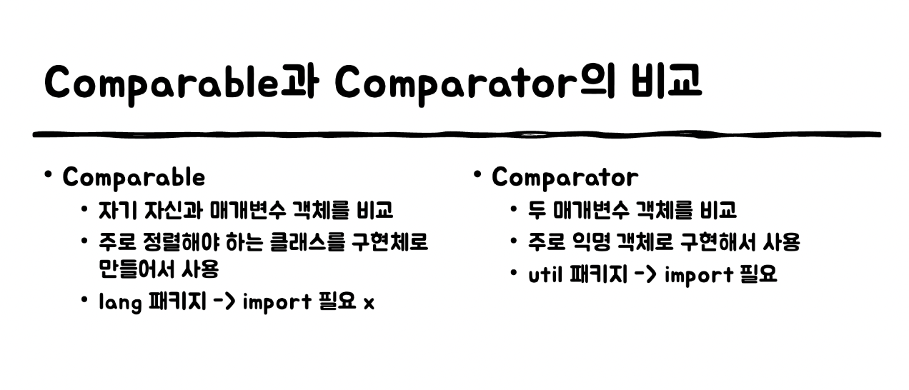

# Comparable을 구현할지 고려하라
- `Comparable` 인터페이스의 유일무이한 메서드인 `compareTo`
- `compareTo`는 단순 동치성 비교에 더해 순서까지 비교할 수 있으며, 제네릭하다
- 사실상 자바 플랫폼 라이브러리의 모든 값 클래스와 열거타입이 `Comparable`을 구현했다
- 명확한 값 클래스를 작성한다면 반드시 `Comparable` 인터페이스를 구현하자
``` java
public interface Comparable<T> {
  public int compareTo(T o);
}
```

## compareTo메서드의 일반 규약
  - 이 객체가 주어진 객체보다 **작으면 음의정수를, 같으면 0을, 크면 양의 정수를 반환**
  - 비교할 수 없는 타입의 객체가 주어지면 `ClassCastException`을 던진다
  - `sgn(x.compareTo(y)) == -sgn(y.compareTo(x))여야 한다`
  - 추이성을 보장해야 한다<br> `(x.compareTo(y) > 0 && y.compareTo(z) > 0)` 이면 `x.compareTo(z) > 0` 이다
  - `x.compareTo(y) == 0이면 sgn(x.compareTo(z)) == sgn(y.compareTo(z))`이다
  - **필수는 아니지만 꼭 지키자!**
    - (x.compareTo(y) == 0) == (x.equals(y))여야 한다
    - **이 규약을 지키지 않은 것 : BigDecimal**
      - `new BigDecimal("1.0")`과 `new BigDecimal("1.00)`
      - `compareTo`로 비교하면 두 인스턴스가 같으나 `equals`로 비교하면 서로 다르다
      - 따라서, `TreeSet`에서는 원소를 1개만, `HashSet`에서는 원소를 2개 갖는다
  - `equals`규약과 주의사항도 똑같다


## 원시타입을 비교할 때 `<` or `>` 대신 `Wrapper` 클래스의 `compare`를 사용하자
  ``` java
  public class Position implements Comparable<Position>{
    private final int position;

    @Override
    public int compareTo(Position target) {
      return Integer.compare(position, target.position)
    }
  }
  ```

## 정렬 기준인 필드가 여러개일 때
  - 가장 핵심적인 필드 먼저! 
    - **if문 사용**
    - `Comparator 인터페이스`의 비교자 생성 메서드를 활용 <br>**(위 방법보다 성능저하가 있다)**
      - `Comparator`는 수많은 보조 생성 메서드들로 무장해 있다
      ``` java
      private static final Comparator<Book> COMPARATOR = Comparator
                                                            .comparingInt((Book book) -> book.price)
                                                            .thenComparing(book -> book.title);

      @Override
      public int compareTo(Book o){
        return COMPARATOR.compare(this, o);
      }
      ```
## 값의 차를 기준으로 비교..?
  ``` java
  static Comparator<Object> hashCodeOrder = new Comparator<> () {
    public int compare(Object o1, Object o2) {
      return o1.hashCode() - o2.hashCode();
    }
  }
  ```
  - 이방식은 사용하지 말자(여러 오류를 낼 가능성이 높음)
    - 부동소수점 계산 오류, 정수오버플로우 등
  - **따라서,**
  - 정적 compare메서드를 활용한 비교자
    ``` java
    static Comparator<Object> hashCodeOrder = new Comparator <>(){
      public int compare(Object o1, Object o2) {
        return Integer.compare(o1.hashCode() , o2.hashCode());
      }
    }
    ```
  - 비교자 생성 메서드를 활용한 비교자
    ``` java
    static Comparator<Object> hashCodeOrder = Comparator.comparingInt(o -> o.hashCode());
    ```


## Comparable VS Comparator
  
  

  
----------


## 핵심정리
- **순서를 고려해야하는 값 클래스의 경우 꼭 구현하자**
- 비교할때는 박싱된 기본 타입 클래스가 제공하는 <br>**정적 compare 메서드**나 <br>**Comparator 인터페이스가 제공하는 비교자 생성메서드**를 사용하자