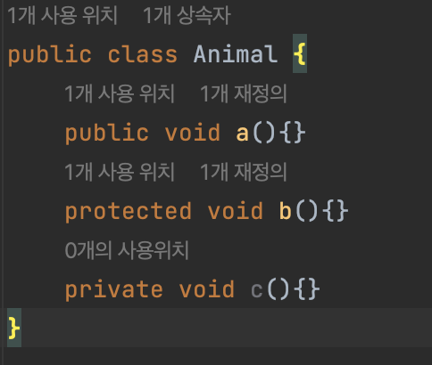
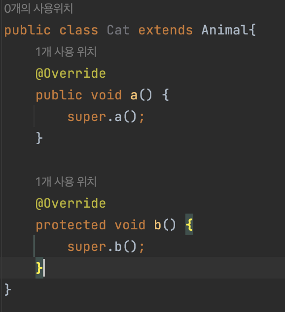
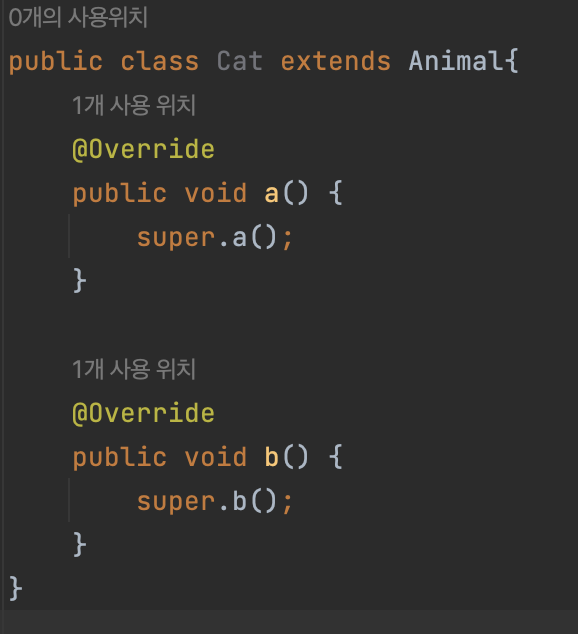
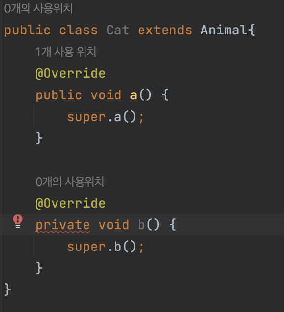
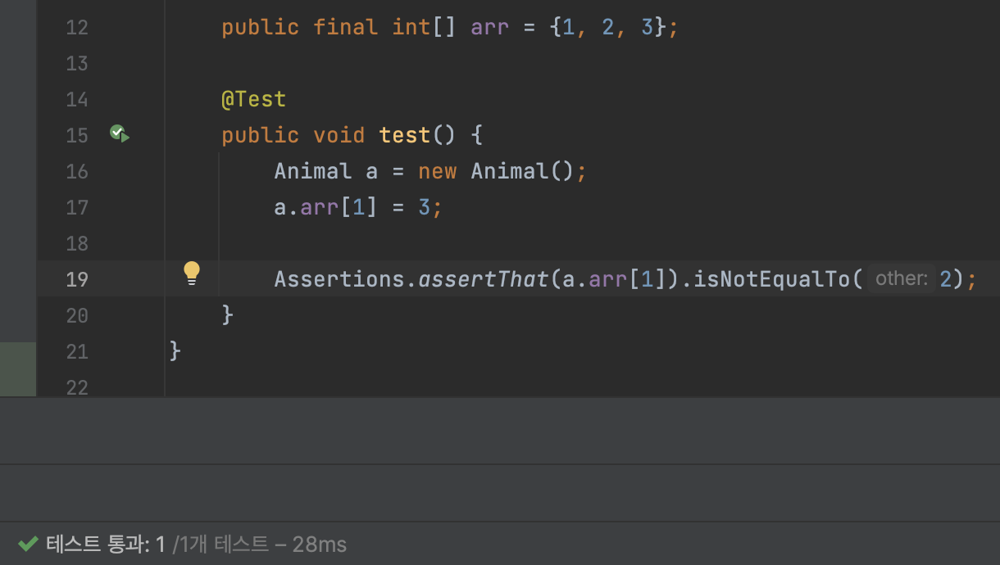
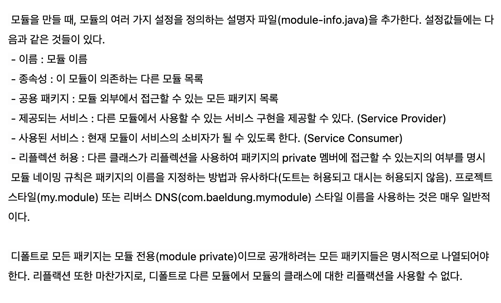
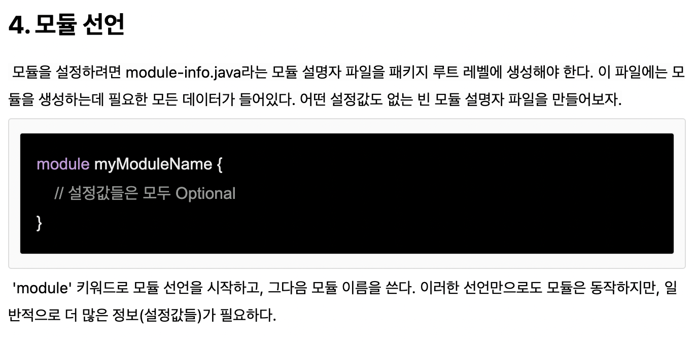

# 클래스와 멤버의 접근 권한을 최소화하라
- **어설프게 설계된 컴포넌트**와 **잘 설계된 컴포넌트**의 가장 큰 차이는 바로<br> 클래스 **내부 데이터**와 **내부 구현 정보**를 외부 컴포넌트로부터 얼마나 잘 숨겼느냐다

## 잘 설계된 컴포넌트
  - ### 정보은닉!
    - 내부데이터와 내부 구현 정보를 외부로부터 잘 숨겨야 한다.
    
  - ### 캡술화!
    - 내부 구현을 완벽히 숨겨, 구현과 API를 깔끔히 분리
  
  ### 오직 API를 통해서만 다른 컴포넌트와 소통하며 서로의 내부 동작방식에는 전혀 개의치 않는다


## 정보은닉의 장점
  - 시스템 개발 속도를 높인다
    - 여러 컴포넌트를 병렬로 개발할 수 있기 때문에
  - 시스템 관리 비용을 낮춘다
    - 각 컴포넌트를 더 빨리 파악하여 디버깅 가능
    - 다른 컴포넌트로 교체 수월
  - 성는 최적화에 도움, 재사용을 높여줌
    - 다른 컴포넌트에 영향을 주지않고 해당 컴포넌트만 최적화 할 수 있기 때문에


## 정보은닉의 핵심, 접근 제한자!
  - 기본원칙은 모든 클래스와 멤버의 **접근성**을 가능한 좁혀야 한다


## 톱 레벨 클래스와 인터페이스
  - 가장 바깥이라는 의미의 **톱 레벨 클래스**
  - `package-private(default)` : 해당 패키지 안에서만 이용(**내부 구현에 해당**)
    - 같은 패키지에 포함되어 있는 다른 클래스까지만 접근을 허용
  - `public` : 공개 API(**API에 해당**)
  - 한 클래스에서만 사용하는 `package-private(default)` 톱 레벨 클래스나, 인터페이스는<br> 이를 사용하는 클래스 안에 `private static`으로 중첩시켜 보자 -> `Inner class`
    - 톱 레벨에 위치한다는 건 같은 패키지의 모든 클래스가 접근할 수 있다는 의미이다.
    - 이 때 `private static`을 중첩시키면 바깥 클래스 하나에서만 접근할 수 있다.
  ``` java
  public class A{
    private int a;
  }
  class B{ // B가 A에서만 쓰이는 클래스라면?
    private int b;
  }

  // Inner Class
  public class A{
    private int a;
    
    private static class B{
        private int b;
    }
  }
  ```

  - ### public일 필요가 없는 클래스의 접근 수준을 package-private 톱 레벨 클래스로 좁히는 일이 가장 중요!


## 접근 수준
  - `private` : 해당 클래스만 접근 가능
  - `package-private(default)` : 같은 패키지에서 접근 가능
    - 접근 제한자를 명시하지 않을 때 적용되지만 **인터페이스의 멤버는 기본적으로 public이 적용된다**
  - `protected` : 같은 패키지 + 하위 클래스에서 접근 가능
  - `public` : 모든 곳에서 접근 가능


## 접근 제한자 설정 과정
  - 클래스의 공개 API를 설계 **(=API)**

    - `protected`와 `public`은 해당 클래스의 구현을 벗어나 공개 API에 영향을 줄 수 있다.<br>내부 동작 방식을 API 문서에 적어 사용자에게 공개하는 경우도 생긴다

  - 그 외의 모든 멤버는 `private`으로 만듬 **(=구현)**
  - 오직 같은 패키지의 다른 클래스가 접근해야 하는 멤버에 한하여 `package-private`으로 **(=구현)**
    - `private`와 `package-private`는 내부 구현용이지만 예외적으로 `Serializable`을 직접 구현한 클래스에서는 공개 API가 될 수도 있다.

    > Serialize (직렬화) : Java 시스템 내부에서 사용되는 Object나 Data를 외부에서도 사용할 수 있도록 byte 형태로 변환하는 기술 <br>Serializable 인터페이스를 상속받음으로써 객체는 직렬화의 조건을 충족함.
  

## 멤버 접근성의 제약
  - **리스코프 치환 원칙**에 의해 상위 클래스의 메소드를 재정의(Override)하는 경우, 그 접근 수준을 상위 클래스보다 좁게 설정할 수 없다.
    - 이 규칙을 어기면 컴파일 오류가 발생한다.
    - **리스코프 치환 원칙** : 상위 클래스의 인스턴스는 하위 클래스의 인스턴스로 대체해 사용할 수 있어야 한다<br> 즉, 상위 타입의 객체를 하위 타입의 객체로 치환해도 동작에 문제가 없어야 하는 규칙

    

    

    

    

  - (class가 interface를 구현하는 건 특별한 예외로, class의 메소드는 모두 `public`으로 선언해야 한다.)


## 코드를 테스트 할 때 접근 범위
  - **적당한 수준까지는 넓혀도 된다**
  - 예를 들어, `public` 클래스의 `private` 멤버를 `package-private`까지 풀어주는 것은 허용할 수 있다
    - 하지만, 그이상은 안된다
  - ### 즉, 테스트만을 위해 클래스, 인터페이스 멤버를 공개 API로 만들어서는 안된다


## public 클래스의 인스턴스 필드는 되도록 public이 아니여야 한다
  - 필드가 **가변 객체(ex : ArrayList)** 를 참조하거나, **final**이 아닌 인스턴스 필드를 `public`으로 선언하면
    - 그 필드와 관련된 모든 것은 **불변식**을 보장할 수 없다

    

    - 언제든지 값을 바꿀 수 있다 보니 멀티 스레드 환경에서 사용하려면 별도의 동기화 처리가 필요하다<br> **-> 스레드 안전하지 않다**
    - 심지어, 필드가 `final`이면서 **불변 객체**를 참조하더라도 문제가 발생
      - **내부구현을 바꾸고 싶어도 그 public 필드를 없애는 방식으로는 리팩토링할 수 없게 된다**
  - 예외로 꼭 필요한 경우 `static final` 상수를 `public`으로 지정할 수 있다 -> **상수를 의미**<br> **(배열이나 가변 List의 경우 값이 가변될 수 있으니 주의할 것.)**
  - 클래스에서 `public static final 배열 필드`를 두거나 이 필드를 반환하는 `접근자 메서드`를 제공해서는 안된다  
    - 배열의 내용이 수정 가능해지므로<br> 만약 어쩔수 없이 한다면 밑의 2가지 방식으로 표현해야 한다
    ``` java
    // 보안 허점이 존재
    public static final Thing[] VALUES = {...};

    // 1번째 방법
    private static final Thing[] PRIVATE_VALUES = {...};
    public static final List<Thing> VALUES = 
        Collections.unmodifiableList(Arrays.asList(PRIVATE_VALUES));
    
    // 2번째 방법
    private static final Thing[] PRIVATE_VALUES = {...};
    public static final Thing[] values(){
      return PRIVATE_VALUES.clone();
    }
    ```
    > `Arrays.asList`<br>
    Arrays.asList()는 Arrays의 private 정적 클래스인 ArrayList를 리턴한다.<br>
    java.util.ArrayList 클래스와는 다른 클래스이다.<br>
    java.util.Arrays.ArrayList 클래스는 set(), get(), contains() 메서드를 가지고 있지만<br>
    원소를 추가하는 메서드는 가지고 있지 않기 때문에 사이즈를 바꿀 수 없다.

    > `clone`<br>
    새로운 배열을 생성하고 다른 **참조값**을 가지게 된다


## Java 9와 모듈 시스템
  - **Java 9**에서는 모듈 시스템이라는 개념이 도입되었다. 
  - 모듈은 패키지의 모음 같은 것인데 모듈에 속하는 패키지 중 공개(export)할 것을 선언하는 파일이 생성되었다. (관례상 `module-info.java`)
  - 이 파일에 존재하지 않는 패키지라면 `public, protected` 멤버라도 모듈 외부에서 접근이 불가능하다.
  - 다른 모듈에서는 접근할 수 없으나 같은 모듈이라면 패키지가 달라도 접근할 수 있는 **접근 제어자**가 생긴 것이다.

  

  

  - **명명되지 않은 모듈**
    - 이름 없는 모듈은 `module-info.java` 선언 없이 빌드된 JAR입니다. <br> 이름이 지정되지 않은 모듈은 **다른 모든 모듈**을 필요로 하며 모든 패키지도 내보냅니다.

  - **명명된 모듈**
    - 명명된 모듈은 루트 폴더에 있는 모듈 선언 파일 `module-info.java`로 생성되는 모듈입니다. 
    - 모듈에는 이름이 있으며 다른 모듈에 의지합니다. 
    - **명명된 모듈**이 **명명되지 않은 모듈**에 액세스할 수 있다는 의미는 아니다
    - 즉, 이 모듈을 컴파일하고 실행할 때 **필요한** 모듈이 있어야 합니다. 그렇지 않으면 컴파일 오류 또는 런타임 오류가 발생할 수 있습니다.

  - **자동 모듈**
    - 자동 모듈은 다른 모든 모듈을 읽을 수 있는 모듈이며 다른 모든 모듈은 그 반대의 경우도 마찬가지입니다. 
    - **명명된 모듈**도 자동 모듈을 읽을 수 있습니다. 
    - 자동 모듈에는 해당 jar 이름에서 파생된 모듈 이름이 있습니다.


  > ex: JDK<br>
    자바 라이브러리에서 공개하지 않은 패키지들은 해당 모듈 밖에서 접근이 불가능함<br>
    ❓ 모듈 시스템이 없던 시절의 코드는?<br>
    JAR가 모듈 경로가 아닌 classpath에 로드된 것을 이름 없는 모듈(Unnamed Module)이라고 한다.<br>
    모듈 공개 여부와 상관 없이 public, protected가 모듈 밖에서도 접근이 가능하다.<br>
    모듈이 없는 것처럼 동작한다는 의미인데 이전에 작성되었던 Java 코드와의 하위 호환성을 유지하기 위함이다.

-----------------
## 핵심정리
  - 접근성은 최소환으로 유지하자!
  - `public` 클래스는 상수용`(public static final)`필들 외에는 어떠한 `public` 필드도 가져서는 안된다
    - `public static final`필드가 참조하는 객체가 불변인지 확인해라