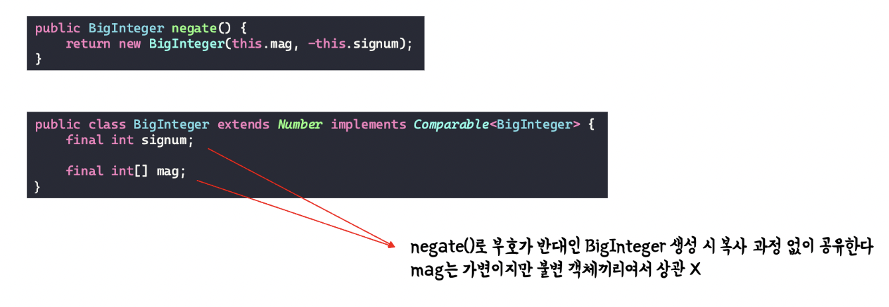

# 변경 가능성을 최소화 하라
- ### 불변클래스 -> String
  - 인스턴스의 내부 값을 수정할 수 없는 클래스
  - 가변클래스보다 설계하고 구현하고 사용하기 쉽다
  - 오류가 생길 여지가 적고 안전하다

## 클래스를 불변으로 만드는 5가지 규칙
- 객체의 상태를 변경하는 메서드를 제공하지 않는다
  - `setter`가 존재하지 않아야한다
- 클래스를 확장할 수 없도록 한다
  - 상속을 막는다는 개념
  - `class`의 선언을 `final`로 선언하는 방법 존재
  - 생성자를 `private`으로 막아 상속을 막는다<br> **-> 정적 팩토리 메서드 사용**
- 모든필드를 `private final`로 선언한다
    - `public final`로 선언하면 다음 릴리스에서 내부 표현을 바꾸지 못한다<br> `public`은 접근자 메서드가 필요하지 않아 생성하지 않으므로

- ### 필드가 private final이라고 불변이 아니다
  - `원시타입`의 필드는 `private final`이면 불변
  - `참조타입`의 필드는 `private final`이어도 가변일 수 있다

- ### 자신 외에는 내부의 가변 컴포넌트에 접근할 수 없도록 한다
  - 방어적 복사를 사용
  ``` java
  public class Lotto{
    private final List<Integer> numbers;

    public Lotto(List<Integer> numbers){
      this.numbers = List.copyOf(numbers);
    } // 방어적 복사

    public List<Integer> getNumbers(){
      return Collection.unmodifiableList(numbers);
    } // 방어적 복사
  }
  ```

``` java
public final class Complex {
  private final double re;
  private final double im;

  public Complex(double re, double im){
    this.re = re;
    this.im = im;
  }

  public Complex minus(Complex c){
    return new Complex(re - c.re, im - c.im);
  }
}
```
> 피연산자에 함수를 적용해 그결과를 반환하지만,<br> 피연산자 자체는 그대로인 프로그래밍 패턴을 **함수형 프로그래밍**이라 한다
> **절차적 혹은 명령형 프로그래밍**에서는 메서드에서 피연산자인 자신을 수정해 자신의 상태가 변하게 된다

## 이러한 함수형 프로그래밍은 코드에 불변이 되는 영역의 비율이 높아지는 장점을 가진다
  - `new`로 새로운 객체를 반환하므로


## 불변객체는 왜 써야하는가?
- 불변객체는 근본적으로 스레드 안전하여 따로 동기화할 필요가 없다
  - ### 안심하고 공유가능

  

- 캐싱기능을 사용 수월
- 방어적 복사가 필요없다
  - 복사자체가 의미가 없다
- 자유롭게 공유할 수 있으며, 불변 객체끼리는 내부 데이터를 공유할 수 있다
  


- ### 객체를 만들 때 다른 불변 객체들을 구성요소로 사용하면 이점이 많다
  - `Set`의 구성요소나 `Map`의 `Key`
  - `Set`의 구성요소나 `Map`의 `key`가 가변이면 해당 자료구조 자체의 불변식이 허물어진다
   - `Map<Month, Integer> attendanceBook = new EnumMap<Month, Integer>(Month.class);`
   - Month가 가변이라면 Month를 수정하여 attendanceBook의 불변식을 깨뜨릴 수 있다

  
## 불변객체 사용의 단점
- ### 값이 다르면 반드시 독립된 객체로 만들어야 한다
  - 값의 가짓수가 많으면 비용이 크다 <br> **BigInteger의 비트 하나를 바꾸는 연산**
    - **해결책**
      - 다단계 연산 -> **모듈러 지수연산**
      - 가변 동반 클래스
        - String -> `StringBuilder`
        - BigInteger -> `MutableBigInteger`

        > `MytableBigInteger` 등은 `package-private` 이여서 클라이언트가 사용하지 못하고 `BigInteger`의 메서드들이 내부적으로 사용

      


## 불변클래스를 만드는 또 다른 설계 방법
- ### 정적팩토리를 구성해 모든 생성자를 private으로 설정


-----------------

## 핵심정리
- ### Getter가 있다고해서 무조건 Setter를 만들지는 말자(특히 값(Value) 객체(Object))
- ### 클래스는 꼭 필요한 경우가 아니라면 불변이어야 한다
  - 장점이 무수히많고, 단점은 잠재적 성능저하 하나 뿐이라
- ### 불변으로 만들 수 없는 클래스라도 변경할 수 있는 부분을 최소한으로 줄이자
  - 변경해야 할 필드를 뺀 나머지 모두를 final로 선언
- ## 다른 합당한 이유가 없다면 모든 필드는 private final이여야 한다
- ### 생성자는 불변식 설정이 모두 완료된(초기화)가 완벽히 끝난 상태의 객체를 생성해야 한다  
  - 생성자와 정적 팩터리 외에는 그 어떤 초기화 메서드도 `public`으로 제공해서는 안된다


-----------


## <참고>

### 참조 타입에서의 불변
- 원시 타입이 아닌 **[참조 타입](https://www.notion.so/vs-d4deb3c2caf7418fa4b910ac7cd353f3?pvs=21)에서 불변은** **조금 더 까다로운 형태로 불변 객체를 만들어야 한다**

```java
    import java.util.List;

    public class Cars {
    	private final List<Car> cars;

    	public Cars(List<Car> cars) {
    		this.cars = cars;
    	}
    }

    public class Car {
    	private final String name;

    	public Car(String name) {
    		this.name = name;
    	}
    }
```

- 위의 예제에서 `Cars` 는 이름을 가지고 있는 자동차를 `List` 의 형태로 가지고 있습니다. 
- 이 경우 **Cars는 Setter와 Getter가 존재하지 않기 때문에** 외부에서 값을 제어할 수 없다고 생각하기 쉽습니다. 

**하지만 Cars는 불변 객체가 아닙니다. 아래의 예를 통해 확인해 보자면..**

```java
    public static void main(String[] args) {
    		List<Car> carNames = new ArrayList<>();
    		carNames.add(new Car("hodol"));
    		Cars cars = new Cars(carNames);  // hodol만 들어간 리스트를 통해 생성

    		for(Car car : cars.getCars()) {
    			System.out.println(car.toString()); // 결과 : 호돌
    		}
    		System.out.println(cars);  // 주소 kail.study.java.study.immutable.Cars@4b1210ee

    		carNames.add(new Car("pobi")); //다른 값을 추가로 넣어줌.
    		System.out.println(cars) // 주소 kail.study.java.study.immutable.Cars@4b1210ee

    		for(Car car : cars.getCars()) {
    			System.out.println(car.toString()); //결과 : 호돌 포비
    		}
```

- Cars가 생성될 때 인자로 넘어온 리스트를 외부에서 변경하면 Cars가 참조하고 있는 내부 인스턴스 또한 변한다는 것을 확인 할 수 있습니다. 
위의 예에서 Cars의 인스턴스 변수인 `private final List cars` 가 불변이길 원하지만 다른 값을 넣더라도 같은 주소 값을 가지면서 `pobi` 라는 값을 추가적으로 갖게 되었습니다.

- 다시 한번 불변객체에 대해 정의하자면 **불변 객체란 외부에서 불변 객체의 값을 수정할 수 없는 객체를 의미합니다.**

- **위의 예에서는 외부(Main method)에서 Cars가 가지고 있는 cars라는 인스턴스 변수의 요소를 변경할 수 있었기 때문에 불변객체라고 할 수 없는 것입니다.**

그렇다면 위의 예제에서 Cars를 어떻게 불변 객체로 만들 수 있을까요?

```java
    public class Cars {
    	private final List<Car> cars;

    	public Cars(List<Car> cars) {
    		this.cars = new ArrayList<>(cars);
    	}

    	public List<Car> getCars() {
    		return cars;
    	}

    // 위와 같은 Main method 실행 결과

    //[kail.study.java.study.immutable.Car@4b1210ee]  -- 서로 다른 주소값
    //hodol
    //kail.study.java.study.immutable.Cars@4d7e1886
    //hodol -- pobi가 추가되지 않음.
```

- 생성자를 통해 값을 전달받을 때 `new ArrayList<>(cars)` 를 통해 새로운 값을 참조하도록 복사하였습니다. 
이렇게 되면 외부에서 넘겨주는 List와 내부적으로 사용하는 인스턴스 변수가 **참조하는 값이 다르기 때문에 외부에서 제어가 불가능합니다.**

- 그럼 이젠 완벽한 불변 객체라고 할 수 있을까요? 
추가로 변경해야 하는 부분이 있습니다. 
일반적으로 **Dto를 만들거나 혹은 View**에서 사용하기 위해 Getter는 자주 사용이 됩니다. 

그렇다면 **Getter**를 통해 위의 값을 제어하면 어떻게 될까요? 
아래의 예제에서 확인하겠습니다.

```java
    public static void main(String[] args) {
    		List<Car> carNames = new ArrayList<>();
    		carNames.add(new Car("hodol"));
    		Cars cars = new Cars(carNames);

    		for(Car car : cars.getCars()) {
    			System.out.println(car.getName());
    		}

    		cars.getCars().add(new Car("pobi"));

    		for(Car car : cars.getCars()) {
    			System.out.println(car.getName());
    		}
    	}

    // 실행 결과
    // hodol

    // hodol
    // pobi
```

- 실행 결과 Cars의 인스턴스 변수가 가리키고 있는 실제 데이터에 pobi가 추가된 것을 볼 수 있습니다. 

이를 방지하기 위해선 `Collections` 가 제공해주는 api를 활용하여 이런 **부작용을 방지 할 수 있습니다.**

```java
    public class Cars {
    	private final List<Car> cars;

    	public Cars(List<Car> cars) {
    		this.cars = new ArrayList<>(cars);
    	}

    	public List<Car> getCars() {
    		return Collections.unmodifiableList(cars);
    	}
    }
```

- 이제는 정말 외부에서 자동차들의 리스트를 담고 있는 변수 cars에 대해서 어떠한 제어도 할 수 없는 상태가 되었습니다.

- 외부에서 값을 재할당하여 사용할 순 있지만, Cars의 인스턴스 변수가 가리키고 있는 값에 대해서는 불변이라고 말할 수 있기 때문에 **완벽한 불변 객체**라고 할 수 있습니다.

**외부에서 값을 재할당해서 사용할 수 있다고?**

```java
    public static void main(String[] args) {
    		List<Car> carNames = new ArrayList<>();
    		carNames.add(new Car("hodol"));
    		Cars cars = new Cars(carNames);

    		List<Car> anotherCars = new ArrayList<>(cars.getCars());
    		List<Car> cars1 = cars.getCars();

    		anotherCars.add(new Car("pobi"));
    		cars1.add(new Car("pobi"));	} // 실행에서 에러 발생
```


- 위와 같은 작업이 가능하다는 것을 의미합니다. 인스턴스 변수인 cars의 값은 불변이 보장되지만, **외부에서 그 값을 새롭게 선언하여 사용하는 경우는 문제가 없습니다.**

- **서로 다른 주솟값을 가리키고 있기 때문입니다.** 따라서 위의 코드에서 anotherCars.add는 아무 문제 없이 실행되지만 cars1은 인스턴스 변수가 가리키고 있는 값이 같고 `Collections.unmodifiedList` 로 반환하기 때문에 런타임 에러를 발생시킵니다.


## 