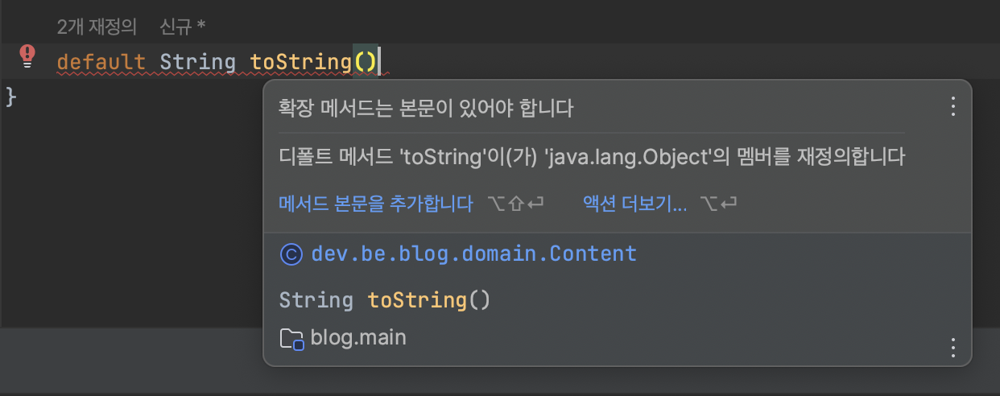

# 추상 클래스보다는 인터페이스를 우선하라

<aside>

📌 **추상 클래스, 인터페이스 두 메커니즘 비교**

</aside>

- **공통점:**
    - 타입을 정의하기 위한 다중 구현 메커니즘
    - 인스턴스 메소드`(디폴트 메서드)`를 구현 형태로 제공

- **차이점:**
    - **추상 클래스:**
        - 추상 클래스가 정의한 타입을 구현하는 클래스는 반드시 추상 클래스의 하위 클래스 
        **-> 새로운 타입 정의에 제약**
    - **인터 페이스:**
        - 어떤 클래스 타입에 있건 인터페이스를 정의한 클래스는 해당 인터페이스 타입 가능 취급

### 여러 인터페이스를 구현할 수 있다 vs 하나의 추상 클래스만 상속받을 수 있다

---

<aside>

📌 **인터페이스는 믹스인 정의에 맞춤이다.**

</aside>

> **믹스인**: 주된 타입 외의 선택적 행위`(ex: compareTo())`를 제공
> 

> `Comparable`은 자신을 구현한 클래스의 인스턴스들끼리는 순서를 정할 수 있다고 선언하는 믹스인 인터페이스이다
> 

가장 적절한 예는 `Comparable`, `Serializable` 을 사용한 예이다.

```java
public class Rank implements Comparable<Rank>, Serializable {

    @Override
    public int compareTo(Rank o) {
        return 0;
    }
}
```

---

<aside>
📌 **계층이 없는 타입 프레임워크가 가능하다.**

</aside>

```java
public interface Comic {

    void laugh();
}

public interface Action {

    void fight();
}

public interface Melo {

    void love();
}

public interface ActionComedy implements Comic, Action {

    void slapstick();
}
```

인터페이스의 경우 ActionComedy 라는 인터페이스를 정의한 클래스라면 모두 ActionComedy 타입으로 취급할 수 있다.

> **추상 클래스로 구현**
> 

```java
public abstract class Comic {

    void laugh();
}

public abstract class Action {

    void fight();
}

public abstract class Melo {

    void love();
}

public abstract class ActionComedy {

    void laugh();
    void fight();
    void slapstick();
}
```

**조합 폭발(combinatorial explosion)** 이 발생한다.

---

<aside>

📌 **인터페이스의 메서드 중 구현 방법이 명백한 것이 있다면, 그 구현을 디폴트 메서드로 제공해 일감을 덜어줄 수 있다**

</aside>

- **디폴트 메서드 제약 사항**
    - `Object` 의 메소드인 `equals`와 `hashcode`같은 것들은 **디폴트 메소드**로 제공하면 안된다
        
        
        
    - 인터페이스는 인스턴스 필드를 가질 수 없고 public이 아닌 정적 메소드를 가질 수 없음.
        - **JAVA 9 부터 private static void method() {} 가능**
    - 본인이 만든 인터페이스가 아니면 디폴트 메소드를 추가할 수 없음.
        - `default` 메서드는 본인이 인터페이스에서 직접 만든 메서드 구현체만 제공되는 것
        - 라이브러리에 있는 인터페이스에다가 부가기능을 제공하는 것은 옳지 못하다
    

---

<aside>

📌 **골격 구현(skeletal implementation) 활용 → 템플릿 메서드 패턴**

</aside>

**인터페이스와 추상 클래스의 장점을 모두 취하는 방법**

- 인터페이스로 타입을 정의, **필요하면** 디폴트 메소드도 제공
- 골격 구현 클래스가 나머지 메소드들을 구현

```java
public interface Athlete {

    void 근육을_키우자();
    void 지구력을_기르자();
    void 연습하자();
    void 루틴();
}

public class SoccerPlayer implements Athlete {

    @Override
    void 근육을_키우자() {
        System.out.println("헬스장 레츠고");
    }

    @Override
    void 지구력을_기르자() {
        System.out.println("청계천 러닝");
    }

    @Override
    void 연습하자() {
        System.out.println("슈팅 연습");
    }

    @Override
    void 루틴() {
        근육을_키우자();
        지구력을_기르자();
        연습하자();
    }

}

public class BaseballPlayer implements Athlete {

    @Override
    void 근육을_키우자() {
        System.out.println("헬스장 레츠고");
    }

    @Override
    void 지구력을_기르자() {
        System.out.println("청계천 러닝");
    }

    @Override
    void 연습하자() {
        System.out.println("배팅 연습");
    }

    @Override
    void 루틴() {
        근육을_키우자();
        지구력을_기르자();
        연습하자();
    }
}
```

```java
public interface Athlete {

    void 근육을_키우자();

    void 지구력을_기르자();

    void 연습하자();

    void 루틴();
}

public abstract class WangsimniAthlete implements Athlete {

    @Override
    public void 근육을_키우자() {
        System.out.println("헬스장 레츠고");
    }

    @Override
    public void 지구력을_기르자() {
        System.out.println("청계천 러닝");
    }

    @Override
    public void 루틴() {
        근육을_키우자();
        지구력을_기르자();
        연습하자();
    }
}

public class SoccerPlayer extends WangsimniAthlete implements Athlete {

    @Override
    public void 연습하자() {
        System.out.println("슈팅 연습");
    }
}

public class BaseballPlayer extends WangsimniAthlete implements Athlete {

    @Override
    public void 연습하자() {
        System.out.println("배팅 연습");
    }
}

public class Main {

  public static void main(String[] args) {

      List<Athlete> athletes = new ArrayList<>();
      Athlete soccerPlayer = new SoccerPlayer();
      Athlete baseballPlayer = new BaseballPlayer();
      athletes.add(soccerPlayer);
      athletes.add(baseballPlayer);

      for (Athlete athlete : athletes) {
        athlete.루틴();
      }
  }
}
```

**디폴트 메소드를 사용하지 않고 추상 골격 구현 클래스(AbstractCharacter)를 구현하여 중복을 없앨 수 있다.골격 구현은 ‘가능한 한’ 인터페이스의 디폴트 메서드로 제공하여 그 인터페이스를 구현한 모든 곳에서 활용하도록 하는 것이 좋다**

## 결론

<aside>

📌 **일반적으로 다중 구현용 타입으로는 인터페이스가 가장 적절하며 재사용성 측면이나 유연성 측면 그리고 다형성 측면에서 인터페이스를 우선하는 것이 옳다.**

</aside>