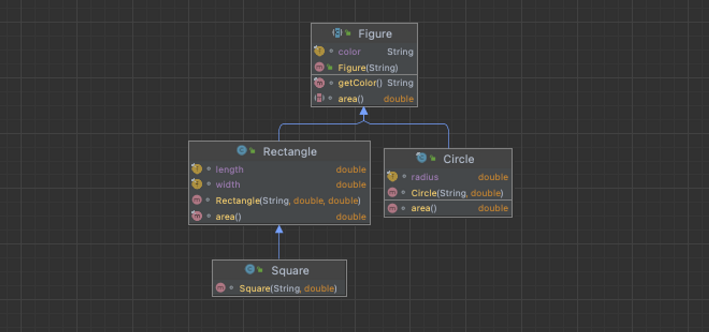

# 태그 달린 클래스보다는 클래스 계층구조를 활용하라

> **태그 달린 클래스**
> 

```java
public class Figure {

	enum Shape {RECTANGLE, CIRCLE}

	final Shape shape;
	String color;
	double width;
	double length;
	double radius;

	// 원
	Figure(double radius, String color) {
    shape = Shape.CIRCLE;
    this.radius = radius;
    this.color = color;
	}

	// 직사각형
	Figure(double width, double length, String color) {
    shape = Shape.RECTANGLE;
    this.width = width;
    this.length = length;
    this.color = color;
	}

	double area() {
    switch (shape) {
        case RECTANGLE:
            return width * length;
        case CIRCLE:
            return Math.PI * (radius * radius);
        default:
            throw new AssertionError(shape);
    }
	}

	String getColor() {
    return color;
	}
}
```

- **열거 타입 선언, 태그 필드, switch 등 쓸데없는 코드가 많다.**
- 만약 필드를 final로 선언하고 싶으면 굳이 사용하지 않는 값도 생성자에서 초기화해야 한다.
- 또 다른 도형을 추가하려면 쓸데없는 코드가 늘어난다.

<aside>

📌 태그달린 클래스는 클래스 계층 구조를 어설프게 흉내낸 아류일 뿐이고, <br>
자바와 같은 객체지향 언어는 타입 하나로 다양한 의미의 객체를 표현하는, <br>
클래스 계층 구조를 활용하는 서브타이핑을 제공한다

</aside>

### 클래스 계층구조를 활용하는 방법

---

### 1. 계층구조의 루트가 될 추상클래스를 선언하자.

- `class Figure`

### 2. 태그 값에 따라 달라지는 동작을 추상 메서드로 선언하자.

- `double area()`

### 3. 태그 값과 상관없이 동일하게 동작하는 메서드는 일반 메서드로 선언하자.

- `String getColor(){}`

### 4. 공통으로 사용하는 데이터 필드는 모두 추상 클래스에 선언하자.

- `String color`

### 5. 태그 별로 추상 클래스를 확장한 구현 클래스를 선언하자.

- `Shape.Circle`
- `Shape.Rectangle`

### 구현

---

```java
public abstract class Figure {
    final String color;

    public Figure(String color) {
        this.color = color;
    }

    final String getColor() {
        return color;
    }

    abstract double area();
}

public final class Circle extends Figure {

    final double radius;

    Circle(String color, double radius) {
        super(color);
        this.radius = radius;
    }

    @Override
    double area() {
        return Math.PI * (radius * radius);
    }
}

public class Rectangle extends Figure {

    final double width;
    final double length;

    Rectangle(String color, double width, double length) {
        super(color);
        this.width = width;
        this.length = length;
    }

    @Override
    double area() {
        return width * length;
    }
}
```

### 장점

---

- 위에서 이야기한 쓸데없는 코드가 모두 사라졌다.
- 남은 필드들은 모두 `final`로 선언할 수 있으므로 생성과 동시에 불필요한 값이 생기지 않는다.
- 만약 삼각형(`Triangle`) 태그를 추가할 예정이었다면, `Shape`과 `Switch`를 사용하지 않고 `Figure` 구현 클래스를 만들면서 쉽게 구현 가능하다.
- 각 타입 사이에 자연스러운 계층 관계를 반영할 수 있어서 유연성은 물론 컴파일타임에서 타입 검사 능력을 높여준다.

## 더 나아가서

만약 해당 코드에서 정사각형(`Square`) 클래스를 추가 하고 싶다면 어떻게 해야할까?

### 1. 태그 활용

---

이와 같은 방식으로 추가할 수 있다. 하지만 쓸데없는 코드가 더 길어지는 경향을 보이게 <br>되고 정사각형도 너비와 높이를 가지기 때문에 `width`와 `length`를 통해서 필드 값을<br> 구현할 수 있지만 정사각형은 너비와 높이가 같은 직사각형이기 때문에 <br>필드값으로 `side`를 가지는 것이 좋아 보인다. 그리고 이렇게 표현하는 것은 <br>정사각형과 직사각형의 계층 구조를 표현할 수 없게 된다.

```java
// 태그 추가
enum Shape {RECTANGLE, CIRCLE, SQUARE}

// area() switch 문 추가
double area() {
    switch (shape) {
        case RECTANGLE:
            return width * length;
        case CIRCLE:
            return Math.PI * (radius * radius);
        case SQUARE:
            return width * length;
        default:
            throw new AssertionError(shape);
    }
}
```

### 2. 계층 구조 활용

---

직사각형의 구현 클래스로 선언하면서 더 쉽게 정사각형을 정의할 수 있고, 우리가 일반적으로 생각하는 정사각형과 직사각형의 계층 구조까지 반영할 수 있다.

```java
public class Square extends Rectangle {

    Square(String color, double side) {
        super(color, side, side);
    }
}
```


---

## 결론

**태그를 통해서 클래스를 사용하는 것보다는 계층 구조를 활용하는 것이 훨씬 좋다.**


## 더 생각해 볼 점

만약 "Woowah" 카지노 블랙잭에서 `Blackjack`, `Stay`, `Bust` 이외에 새롭게 `BustWin`로 카드의 합이 파산되는 순간 29를 초과한다면 배팅 금액을 돌려주는 새로운 규칙이 새로 생겼다고 하자.

Enum 혹은 조건문으로 블랙잭 코드를 구현했던 프로그래머는 여러 조건문(switch)를 추가하면서 구현할지도 모른다. 하지만 계층 구조를 잘 이용한 프로그래머였다면 `Bust`를 구체화하는 `BustWin`을 활용해 볼 수 있지 않을까?