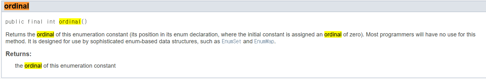

# ordinal 메서드 대신 인스턴스 필드를 사용하라

## 결론

**열거 타입 상수에 연결된 값은 ordinal 메서드로 얻지 말고, 인스턴스 필드에 저장하자.**

열거 타입은 해당 상수가 그 열거 타입에서 몇 번째 위치인지를 반환하는 ordinal이라는 메서드를 반환한다. 그래서 이 ordinal을 쓰고 싶을 수 있다

> **나쁜 예시**
> 

```java
public enum YAxis {
    ONE(1),
    TWO(2),
    THREE(3),
    FOUR(4),
    FIVE(5),
    SIX(6),
    SEVEN(7),
    EIGHT(8);

    ...

    /**
     * 같은 Y축에서 from과 start 사이의 YAxis들 반환
     */
    public static List<YAxis> getBetween(YAxis from, YAxis to) {
        int startOrdinal = Math.min(from.ordinal(), to.ordinal()) + 1;
        int endOrdinal = Math.max(from.ordinal(), to.ordinal());

        return IntStream.range(startOrdinal, endOrdinal)
                .mapToObj(ordinal -> getByValue(ordinal + 1))
                .collect(Collectors.toList());
    }
}
```

- 유지보수하기 힘든 코드
- 상수 선언 순서가 바뀌면 오작동한다
- 이미 사용중인 정수와 값이 같은 상수는 추가할 방법이 없다
- 값을 비워둘 수도 없다

**열거 타입 상수에 연결된 값은 ordinal 메서드로 얻지 말고, 인스턴스 필드에 저장하자.**

애초에 `Enum`의 API 문서에도 이렇게 쓰여있다.

> "대부분 프로그래머는 이 메서드를 쓸 일이 없다. 이 메서드는 EnumSet과 EnumMap 같이 열거 타입 기반의 범용 자료구조에 쓸 목적으로 설계되었다."



```java
    public static List<YAxis> getBetween(YAxis from, YAxis to) {
        int startYPosition = Math.min(from.value, to.value) + 1;
        int endYPosition = Math.max(from.value, to.value);

        return IntStream.range(startYPosition, endYPosition)
                .mapToObj(YAxis::getByValue)
                .collect(Collectors.toList());
    }
```